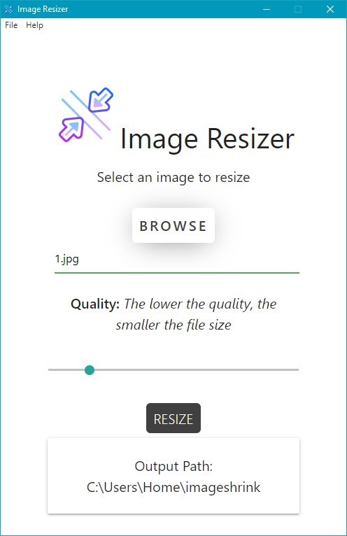

<p align="center">
    
</p>

<h1 align="center">Image Resizer</h1>

An Electron app which compresses(resizes) the given image.

[Scrnshot] <p></p>

## Usage

### Install Dependencies

```
npm install
```

### Run

```
npm start
npm run dev (with Nodemon)
```

### Package

```
npm run package-mac
npm run package-win
npm run package-linux
```

## Logs

- macOS: ~/Library/Logs/imageshrink/main.log
- Windows: %USERPROFILE%\AppData\Roaming\imageshrink\logs\main.log
- Linux: ~/.config/imageshrink/logs/main.log

## LICENSE

MIT
